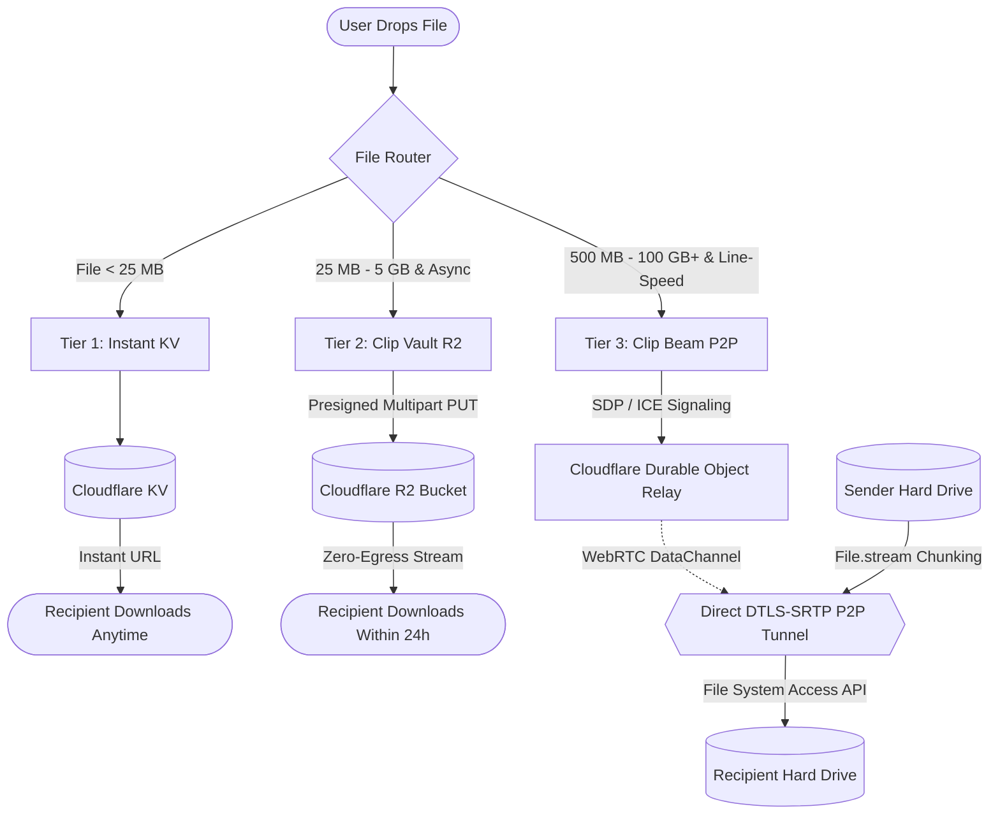
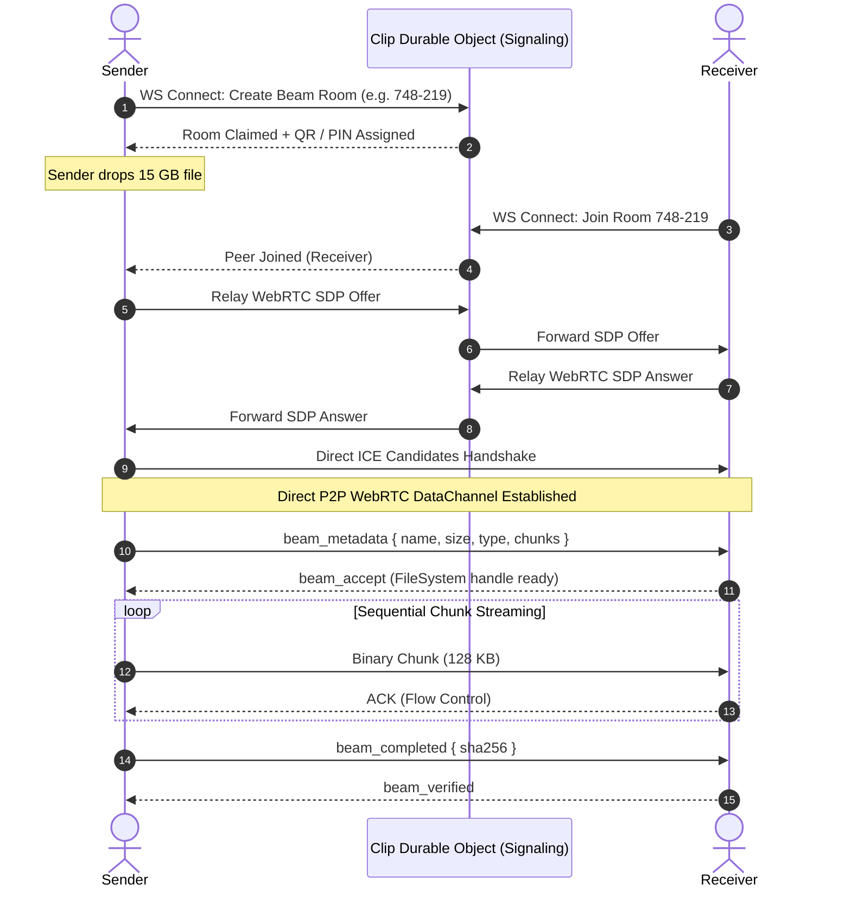
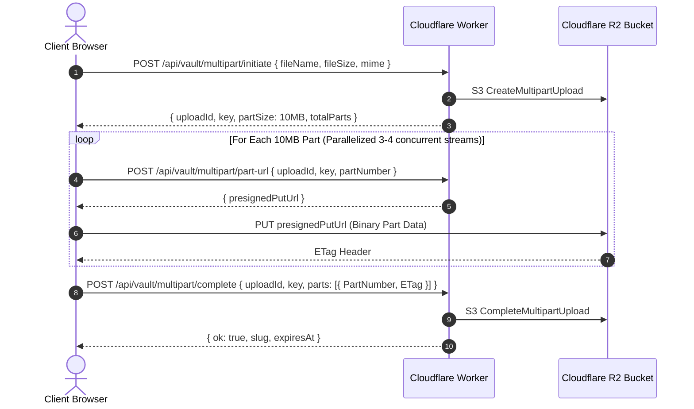

# Clip Hybrid Large File Transfer Architecture Specification
**Author:** Clip Core Engineering Team  
**Status:** Approved Architecture Plan  
**Target Capability:** Superfast 100 MB to 100 GB+ Secure File Transfers  

---

## 1. Executive Summary & Vision

Clip is evolving from a lightweight encrypted pastebin and multi-file text sharing platform into a unified high-speed data transfer engine. While our existing architecture excels at sub-second synchronization for text, pastes, and files under 25 MB via Cloudflare KV and Durable Objects, moving multi-gigabyte datasets (e.g., 4K videos, disk images, archives, datasets) presents three strict technical barriers:

1. **Browser Memory (RAM) Ceiling:** Standard browser file readers load contents into RAM. In Chromium and WebKit, tab heaps cap at 2 GB – 4 GB, causing tabs to instantly crash when buffering massive files.
2. **Edge KV Value Limits:** Cloudflare KV is architected for high-frequency reads of small payloads with a 25 MB – 50 MB hard limit.
3. **Bandwidth Egress Costs:** Storing terabytes of temporary files on standard S3 buckets incurs prohibitively expensive egress bandwidth charges ($0.09/GB).

To solve this permanently, Clip adopts a **Tri-Tier Hybrid Storage & Streaming Architecture**:

| Tier | Engine | Size Profile | Availability | Network Speed | Cloud Storage Cost |
| :--- | :--- | :--- | :--- | :--- | :--- |
| **Tier 1: Instant KV** | Cloudflare Workers KV | `< 25 MB` | Persistent (1h – Permanent) | Edge Global Cache | Minimal KV Reads |
| **Tier 2: Clip Vault** | Cloudflare R2 Multipart Presigned Uploads | `25 MB – 5 GB` | Asynchronous (24h – 7d) | Cloudflare Edge Ingestion | $0 Egress Bandwidth |
| **Tier 3: Clip Beam** | Direct WebRTC P2P Disk-to-Disk Streaming | `500 MB – 100 GB+` | Synchronous Peer-to-Peer | Gigabit LAN / Line Speed | **$0 Server Cost** |

---

## 2. Tri-Tier Architecture Diagram



---

## 3. Tier 3: "Clip Beam" — Direct WebRTC P2P Disk-to-Disk Streaming

Clip Beam is a dedicated real-time peer-to-peer streaming engine designed for zero-limits file transfer without loading files into browser memory or touching cloud disks.

### 3.1 Zero-RAM Streaming Pipeline

```
[ Sender Disk ]
      │
      ▼  File.stream() (Browser Native Stream)
[ ReadableStream Chunk Reader (64 KB - 256 KB) ]  <── RAM footprint strictly < 35 MB
      │
      ▼  Backpressure Check (bufferedAmount < 512 KB)
[ RTCDataChannel (DTLS-SRTP Encrypted) ]
      │
      ▼ (Gigabit LAN 50-120 MB/s or Internet Line Speed)
[ RTCDataChannel Receiver ]
      │
      ▼  window.showSaveFilePicker()
[ FileSystemWritableFileStream ]
      │
      ▼
[ Recipient Disk ]
```

#### Key Implementation Pillars:
1. **Streaming Sender:**
   - Utilizes `File.stream()` with `ReadableStreamDefaultReader`.
   - Never loads the whole file into an `ArrayBuffer` or `Blob`.
   - Slices dynamic 64 KB – 256 KB binary chunks on-the-fly.
   - Even when transmitting a 75 GB file, browser tab memory usage remains flat under **35 MB**.

2. **Direct Disk Receiver (File System Access API):**
   - Recipient browser invokes `window.showSaveFilePicker()` upon accepting the transfer.
   - Acquires a direct `FileSystemWritableFileStream` to the local storage drive.
   - Incoming chunks from the `RTCDataChannel` are piped sequentially into `writable.write(chunk)`.
   - On completion, `writable.close()` finalizes the file on disk without intermediate browser RAM caching.

3. **Fallback Chain for Browsers without File System Access API:**
   - *Chromium (Chrome, Edge, Brave, Opera):* Native File System Access API (Primary).
   - *Firefox / Safari / Mobile iOS:* Service Worker chunked `ReadableStream` download piping directly into the browser's native download manager.
   - *Legacy Fallback:* IndexedDB chunked block storage with auto-assembly for files up to 2 GB.

4. **Dynamic Network Backpressure Control:**
   - Monitored via `dataChannel.bufferedAmount`.
   - If `bufferedAmount > 512 KB`, sender pauses `reader.read()`.
   - Resumes automatically on the `bufferedamountlow` event (`dataChannel.bufferedAmountLowThreshold = 128 KB`), preventing socket buffer exhaustion and packet drops.

### 3.2 6-Digit PIN Pairing & Signaling Flow



---

## 4. Tier 2: "Clip Vault" — Cloudflare R2 Presigned Multipart Uploads

For asynchronous sharing where the sender cannot keep their browser tab open until the recipient finishes downloading, Clip integrates with Cloudflare R2.

### 4.1 Why Cloudflare R2?
- **$0 Egress Fees:** Unlike AWS S3 which charges ~$0.09/GB for downloads, Cloudflare R2 charges **$0.00 / GB** egress bandwidth.
- **High Concurrency:** Supports multi-part S3-compatible uploads up to 5 TB per object.
- **Automatic Lifecycle Rules:** Buckets are configured with automatic 24-hour and 7-day expiration policies to purge expired files without worker cron overhead.

### 4.2 Multipart Presigned Upload Lifecycle



### 4.3 Zero-Knowledge Chunked Encryption for R2
To preserve Clip's zero-knowledge privacy guarantee when storing files on R2:
- Each 10 MB chunk is encrypted in the browser with **AES-256-GCM** using a derived PBKDF2 key from the user's password.
- Each chunk generates a deterministic IV based on `masterIV + partIndex`.
- R2 stores strictly encrypted byte blocks; the decryption key never touches Cloudflare.

---

## 5. Unified User Experience & Smart File Router

Clip's UI will feature an intelligent router that recommends the optimal engine based on file size and intent:

### 5.1 Smart Routing Matrix

```
User drops or selects file in Clip:
 │
 ├── File Size < 25 MB:
 │    └── Standard Fast KV Path (Existing Instant Clip)
 │
 ├── File Size 25 MB to 500 MB:
 │    └── Prompt Modal:
 │         ├── [ Option A: Asynchronous Vault (R2) ]
 │         │    "Upload once, shareable for 24h, receiver can download anytime."
 │         └── [ Option B: Instant Clip Beam (P2P) ]
 │              "Instant transfer at LAN gigabit speed, zero wait time."
 │
 └── File Size > 500 MB (up to 100 GB+):
      └── Auto-Selects "Clip Beam"
           "Direct Disk-to-Disk Streaming recommended for maximum speed and zero memory limits."
```

### 5.2 The Dedicated "Clip Beam" Interface (`/beam`)

A new high-performance tab and route in Clip:
- **Pin Code Input & Generator:** Short, memorable 6-digit codes (`392-108`) with instant clipboard copy.
- **Scan-to-Receive QR Code:** Automatically pairs mobile phones to laptops on the same Wi-Fi.
- **Live Transfer Speedometer:**
  - Rolling exponential moving average (EMA) speed gauge (e.g. `⚡ 84.6 MB/s`).
  - Progress bar with remaining size and dynamic ETA countdown.
  - Active network badge (`🟢 Direct LAN Gigabit` vs `🌐 STUN P2P Relay`).
- **Sound & Haptic Feedback:** Subtle completion chime when file transfer finishes.

---

## 6. Security, Privacy & Reliability Considerations

1. **End-to-End Encryption:**
   - All WebRTC DataChannels are encrypted by default via DTLS 1.3 with AES-128-GCM or AES-256-GCM at the transport layer.
   - For sensitive documents, an additional application-layer AES-256-GCM envelope can be toggled using a shared PIN.
2. **Ephemeral Signaling Cleanup:**
   - Durable Object beam rooms expire 10 minutes after creation if no peer joins.
   - Once transfer finishes or peers disconnect, the DO room state is purged immediately.
3. **NAT Traversal & Connectivity:**
   - Standard WebRTC connection attempts direct host-to-host and local LAN connections first.
   - Public STUN servers (`stun:stun.cloudflare.com:3478` and Google STUN) resolve public IP mappings.
   - Optional TURN relay for restrictive corporate symmetric NAT firewalls.
4. **Data Integrity:**
   - Cryptographic SHA-256 checksum calculated on-the-fly by sender stream and validated by receiver stream before write closure.

---

## 7. Phased Implementation Roadmap

### Phase 1: Clip Beam Core (WebRTC Streaming & File System API)
- [ ] Implement `BeamRoom.ts` Durable Object signaling handler (SDP/ICE candidate exchange).
- [ ] Build sender chunked streaming utility (`File.stream()` reader with backpressure).
- [ ] Build receiver disk writer with `FileSystemWritableFileStream` and Service Worker fallback.
- [ ] Create `/beam` UI with 6-digit room PIN generation, QR code modal, and transfer progress bar.

### Phase 2: Telemetry, Speedometer & LAN Direct Optimization
- [ ] Implement real-time transfer telemetry (MB/s gauge, ETA, transferred bytes vs total bytes).
- [ ] Add network connection type detection (Local LAN vs WAN ICE candidates).
- [ ] Integrate Beam shortcuts into `/` (Home Create) and `/live` (Live Pad).

### Phase 3: Cloudflare R2 Vault Integration
- [ ] Provision Cloudflare R2 bucket (`clip-vault-storage`) with 24-hour lifecycle rules.
- [ ] Implement Worker endpoints for S3 multipart presigned URL creation.
- [ ] Build client multipart upload pipeline with progress tracking and parallel chunk uploads.
- [ ] Add client-side AES-256-GCM chunked encryption pipeline for Vault uploads.

### Phase 4: Unified Smart Router & Admin Telemetry
- [ ] Build the file drop router that automatically detects file sizes and suggests KV vs R2 vs Beam.
- [ ] Add Beam active transfer counts and Vault storage statistics to the Admin Dashboard.
- [ ] Write end-to-end integration test suites for chunk assembly and integrity validation.

---
*Document Version: 1.0.0*  
*Last Updated: 2026-10-04*
