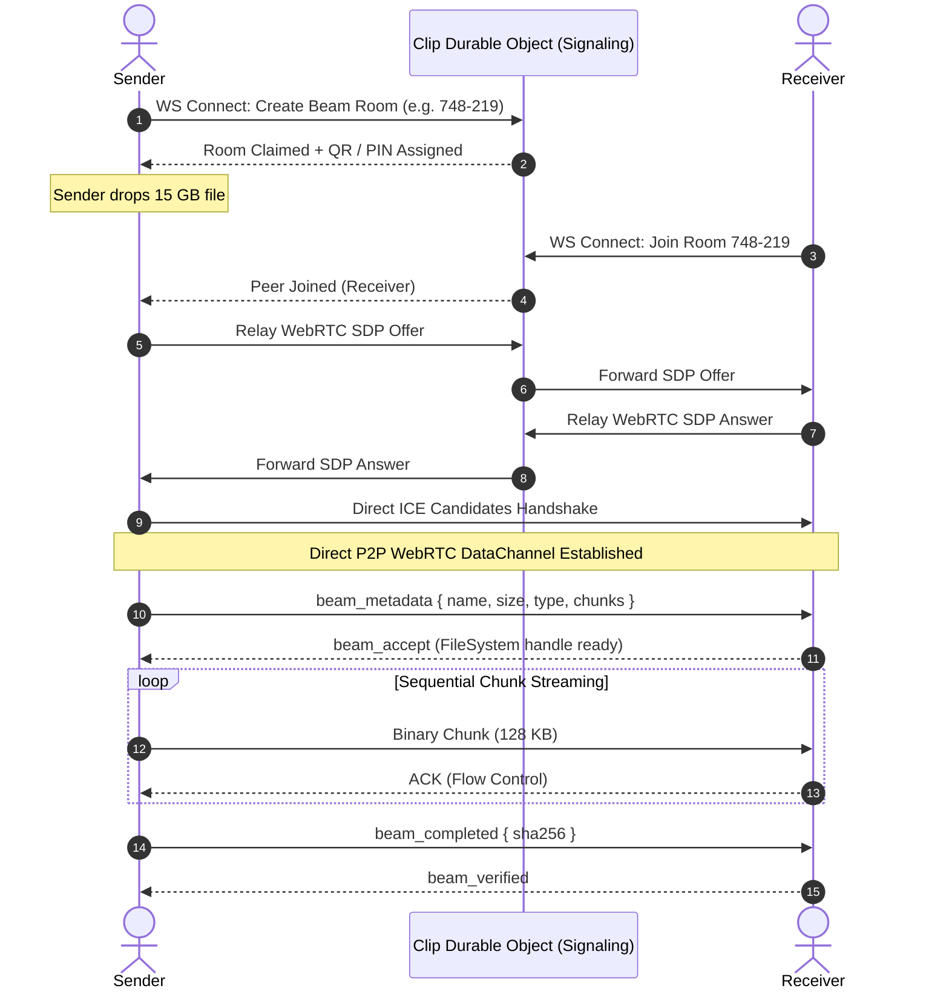
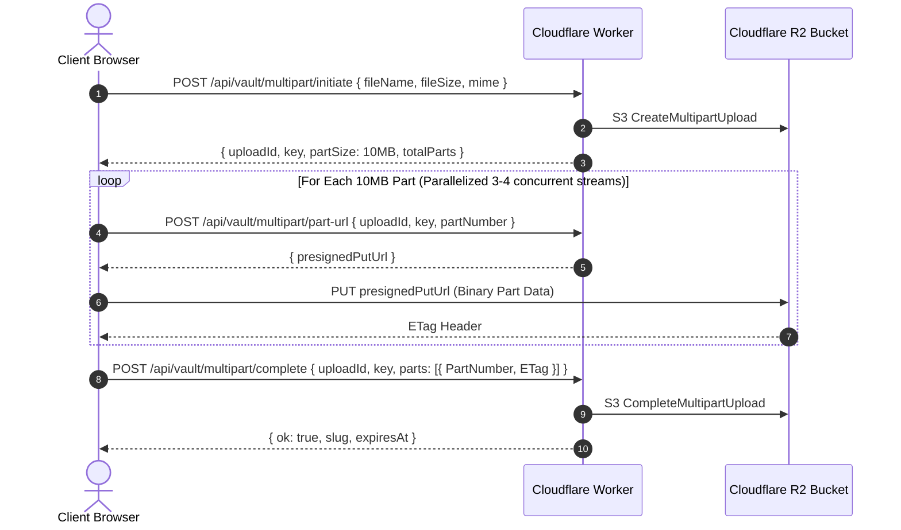

# Clip Hybrid Large File Transfer Architecture Specification
**Author:** Clip Core Engineering Team  
**Status:** Approved Architecture Plan  
**Target Capability:** Superfast 100 MB to 100 GB+ Secure File Transfers  

---

## 1. Executive Summary & Vision

Clip is evolving from a lightweight encrypted pastebin and multi-file text sharing platform into a unified high-speed data transfer engine. While our existing architecture excels at sub-second synchronization for text, pastes, and files under 25 MB via Cloudflare KV and Durable Objects, moving multi-gigabyte datasets (e.g., 4K videos, disk images, archives, datasets) presents three strict technical barriers:

1. **Browser Memory (RAM) Ceiling:** Standard browser file readers load contents into RAM. In Chromium and WebKit, tab heaps cap at 2 GB – 4 GB, causing tabs to instantly crash when buffering massive files.
2. **Edge KV Value Limits:** Cloudflare KV is architected for high-frequency reads of small payloads with a 25 MB – 50 MB hard limit.
3. **Bandwidth Egress Costs:** Storing terabytes of temporary files on standard S3 buckets incurs prohibitively expensive egress bandwidth charges ($0.09/GB).

To solve this permanently, Clip adopts a **Tri-Tier Hybrid Storage & Streaming Architecture**:

| Tier | Engine | Size Profile | Availability | Network Speed | Cloud Storage Cost |
| :--- | :--- | :--- | :--- | :--- | :--- |
| **Tier 1: Instant KV** | Cloudflare Workers KV | `< 25 MB` | Persistent (1h – Permanent) | Edge Global Cache | Minimal KV Reads |
| **Tier 2: Clip Vault** | Cloudflare R2 Multipart Presigned Uploads | `25 MB – 5 GB` | Asynchronous (24h – 7d) | Cloudflare Edge Ingestion | $0 Egress Bandwidth |
| **Tier 3: Clip Beam** | Direct WebRTC P2P Disk-to-Disk Streaming | `500 MB – 100 GB+` | Synchronous Peer-to-Peer | Gigabit LAN / Line Speed | **$0 Server Cost** |

---

## 2. Tri-Tier Architecture Diagram


---

## 3. Tier 3: "Clip Beam" — Direct WebRTC P2P Disk-to-Disk Streaming

Clip Beam is a dedicated real-time peer-to-peer streaming engine designed for zero-limits file transfer without loading files into browser memory or touching cloud disks.

### 3.1 Zero-RAM Streaming Pipeline

```
[ Sender Disk ]
      │
      ▼  File.stream() (Browser Native Stream)
[ ReadableStream Chunk Reader (64 KB - 256 KB) ]  <── RAM footprint strictly < 35 MB
      │
      ▼  Backpressure Check (bufferedAmount < 512 KB)
[ RTCDataChannel (DTLS-SRTP Encrypted) ]
      │
      ▼ (Gigabit LAN 50-120 MB/s or Internet Line Speed)
[ RTCDataChannel Receiver ]
      │
      ▼  window.showSaveFilePicker()
[ FileSystemWritableFileStream ]
      │
      ▼
[ Recipient Disk ]
```

#### Key Implementation Pillars:
1. **Streaming Sender:**
   - Utilizes `File.stream()` with `ReadableStreamDefaultReader`.
   - Never loads the whole file into an `ArrayBuffer` or `Blob`.
   - Slices dynamic 64 KB – 256 KB binary chunks on-the-fly.
   - Even when transmitting a 75 GB file, browser tab memory usage remains flat under **35 MB**.

2. **Direct Disk Receiver (File System Access API):**
   - Recipient browser invokes `window.showSaveFilePicker()` upon accepting the transfer.
   - Acquires a direct `FileSystemWritableFileStream` to the local storage drive.
   - Incoming chunks from the `RTCDataChannel` are piped sequentially into `writable.write(chunk)`.
   - On completion, `writable.close()` finalizes the file on disk without intermediate browser RAM caching.

3. **Fallback Chain for Browsers without File System Access API:**
   - *Chromium (Chrome, Edge, Brave, Opera):* Native File System Access API (Primary).
   - *Firefox / Safari / Mobile iOS:* Service Worker chunked `ReadableStream` download piping directly into the browser's native download manager.
   - *Legacy Fallback:* IndexedDB chunked block storage with auto-assembly for files up to 2 GB.

4. **Dynamic Network Backpressure Control:**
   - Monitored via `dataChannel.bufferedAmount`.
   - If `bufferedAmount > 512 KB`, sender pauses `reader.read()`.
   - Resumes automatically on the `bufferedamountlow` event (`dataChannel.bufferedAmountLowThreshold = 128 KB`), preventing socket buffer exhaustion and packet drops.

### 3.2 6-Digit PIN Pairing & Signaling Flow



---

## 4. Tier 2: "Clip Vault" — Cloudflare R2 Presigned Multipart Uploads

For asynchronous sharing where the sender cannot keep their browser tab open until the recipient finishes downloading, Clip integrates with Cloudflare R2.

### 4.1 Why Cloudflare R2?
- **$0 Egress Fees:** Unlike AWS S3 which charges ~$0.09/GB for downloads, Cloudflare R2 charges **$0.00 / GB** egress bandwidth.
- **High Concurrency:** Supports multi-part S3-compatible uploads up to 5 TB per object.
- **Automatic Lifecycle Rules:** Buckets are configured with automatic 24-hour and 7-day expiration policies to purge expired files without worker cron overhead.

### 4.2 Multipart Presigned Upload Lifecycle



### 4.3 Zero-Knowledge Chunked Encryption for R2
To preserve Clip's zero-knowledge privacy guarantee when storing files on R2:
- Each 10 MB chunk is encrypted in the browser with **AES-256-GCM** using a derived PBKDF2 key from the user's password.
- Each chunk generates a deterministic IV based on `masterIV + partIndex`.
- R2 stores strictly encrypted byte blocks; the decryption key never touches Cloudflare.

---

## 5. Unified User Experience & Smart File Router

Clip's UI will feature an intelligent router that recommends the optimal engine based on file size and intent:

### 5.1 Smart Routing Matrix

```
User drops or selects file in Clip:
 │
 ├── File Size < 25 MB:
 │    └── Standard Fast KV Path (Existing Instant Clip)
 │
 ├── File Size 25 MB to 500 MB:
 │    └── Prompt Modal:
 │         ├── [ Option A: Asynchronous Vault (R2) ]
 │         │    "Upload once, shareable for 24h, receiver can download anytime."
 │         └── [ Option B: Instant Clip Beam (P2P) ]
 │              "Instant transfer at LAN gigabit speed, zero wait time."
 │
 └── File Size > 500 MB (up to 100 GB+):
      └── Auto-Selects "Clip Beam"
           "Direct Disk-to-Disk Streaming recommended for maximum speed and zero memory limits."
```

### 5.2 The Dedicated "Clip Beam" Interface (`/beam`)

A new high-performance tab and route in Clip:
- **Pin Code Input & Generator:** Short, memorable 6-digit codes (`392-108`) with instant clipboard copy.
- **Scan-to-Receive QR Code:** Automatically pairs mobile phones to laptops on the same Wi-Fi.
- **Live Transfer Speedometer:**
  - Rolling exponential moving average (EMA) speed gauge (e.g. `⚡ 84.6 MB/s`).
  - Progress bar with remaining size and dynamic ETA countdown.
  - Active network badge (`🟢 Direct LAN Gigabit` vs `🌐 STUN P2P Relay`).
- **Sound & Haptic Feedback:** Subtle completion chime when file transfer finishes.

---

## 6. Security, Privacy & Reliability Considerations

1. **End-to-End Encryption:**
   - All WebRTC DataChannels are encrypted by default via DTLS 1.3 with AES-128-GCM or AES-256-GCM at the transport layer.
   - For sensitive documents, an additional application-layer AES-256-GCM envelope can be toggled using a shared PIN.
2. **Ephemeral Signaling Cleanup:**
   - Durable Object beam rooms expire 10 minutes after creation if no peer joins.
   - Once transfer finishes or peers disconnect, the DO room state is purged immediately.
3. **NAT Traversal & Connectivity:**
   - Standard WebRTC connection attempts direct host-to-host and local LAN connections first.
   - Public STUN servers (`stun:stun.cloudflare.com:3478` and Google STUN) resolve public IP mappings.
   - Optional TURN relay for restrictive corporate symmetric NAT firewalls.
4. **Data Integrity:**
   - Cryptographic SHA-256 checksum calculated on-the-fly by sender stream and validated by receiver stream before write closure.

---

## 7. Phased Implementation Roadmap

### Phase 1: Clip Beam Core (WebRTC Streaming & File System API)
- [ ] Implement `BeamRoom.ts` Durable Object signaling handler (SDP/ICE candidate exchange).
- [ ] Build sender chunked streaming utility (`File.stream()` reader with backpressure).
- [ ] Build receiver disk writer with `FileSystemWritableFileStream` and Service Worker fallback.
- [ ] Create `/beam` UI with 6-digit room PIN generation, QR code modal, and transfer progress bar.

### Phase 2: Telemetry, Speedometer & LAN Direct Optimization
- [ ] Implement real-time transfer telemetry (MB/s gauge, ETA, transferred bytes vs total bytes).
- [ ] Add network connection type detection (Local LAN vs WAN ICE candidates).
- [ ] Integrate Beam shortcuts into `/` (Home Create) and `/live` (Live Pad).

### Phase 3: Cloudflare R2 Vault Integration
- [ ] Provision Cloudflare R2 bucket (`clip-vault-storage`) with 24-hour lifecycle rules.
- [ ] Implement Worker endpoints for S3 multipart presigned URL creation.
- [ ] Build client multipart upload pipeline with progress tracking and parallel chunk uploads.
- [ ] Add client-side AES-256-GCM chunked encryption pipeline for Vault uploads.

### Phase 4: Unified Smart Router & Admin Telemetry
- [ ] Build the file drop router that automatically detects file sizes and suggests KV vs R2 vs Beam.
- [ ] Add Beam active transfer counts and Vault storage statistics to the Admin Dashboard.
- [ ] Write end-to-end integration test suites for chunk assembly and integrity validation.

---

## 8. Competitive Market Benchmark & Feature Matrix

To understand why the Tri-Tier Hybrid architecture gives Clip an insurmountable advantage, here is an objective technical comparison with existing market solutions:

| Feature / Capability | **Clip Hybrid (Proposed)** | **Wormhole.app** | **PairDrop (Snapdrop)** | **ToffeeShare** | **WeTransfer** | **Send (Firefox Send Fork)** |
| :--- | :--- | :--- | :--- | :--- | :--- | :--- |
| **Max File Size** | **100 GB+** (P2P Beam)<br>5 GB (R2 Vault) | 10 GB hard cap<br>(5 GB P2P / 5 GB S3) | Unlimited (P2P only) | Unlimited (P2P only) | 2 GB (Free tier)<br>Hard paywall for >2 GB | 2.5 GB hard cap |
| **Transfer Engine** | **Tri-Tier Hybrid**<br>(KV + R2 Vault + P2P Beam) | Dual Hybrid<br>(Central Server + P2P) | Pure WebRTC P2P | Pure WebRTC P2P | Central Cloud Server (AWS S3) | Central Cloud Server |
| **Tab Persistence** | **Optional** for Vault/KV (< 5 GB)<br>**Required** for Beam (P2P) | **Optional** (< 5 GB)<br>**Required** (> 5 GB) | **Strictly Required**<br>(Tab must stay open) | **Strictly Required**<br>(Tab must stay open) | **Not Required**<br>(Uploaded to server) | **Not Required**<br>(Uploaded to server) |
| **RAM Memory Crash Risk (>5 GB)** | **Zero (< 35 MB RAM)**<br>File System Access API | Very Low<br>Chunked cache | **High on large files**<br>Buffers chunks in RAM | Moderate<br>Chunked IndexedDB | N/A<br>Standard HTTP upload | Moderate<br>Blobs in memory |
| **Zero-Knowledge Encryption** | **100% E2E**<br>AES-256-GCM + DTLS | 100% E2E<br>128-bit AES-GCM | DTLS transport only<br>(No app-layer cipher) | DTLS transport only<br>(No app-layer cipher) | ❌ **None**<br>Server inspects files | 100% E2E<br>AES-128-GCM |
| **Accounts / Ads / Tracking** | **Zero Accounts · 0 Ads**<br>100% Open Source | Zero Accounts · 0 Ads<br>Closed-source backend | Zero Accounts · 0 Ads<br>100% Open Source | Heavy 3rd-party Ads<br>Closed Source | Ads & Upsell Paywalls<br>Closed Source | Zero Accounts · 0 Ads<br>Open Source |
| **Collaborative LivePad / Pastebin** | **Yes (Built-in)** | ❌ No | ❌ No | ❌ No | ❌ No | ❌ No |

### Key Takeaways from Competitors:
1. **Wormhole.app:** Capped at 10 GB and uses a proprietary, closed-source backend. Does not integrate with collaborative text, LivePads, or permanent pastes.
2. **PairDrop / Snapdrop:** Pure P2P with no persistent cloud storage. If the sender closes their laptop or loses Wi-Fi for 1 second, the recipient's download fails permanently.
3. **ToffeeShare:** Plagued with intrusive third-party ads, no permanent storage, and proprietary closed-source infrastructure.
4. **WeTransfer:** Monopolistic freemium model that caps free transfers at 2 GB, enforces email tracking, and analyzes user files on unencrypted AWS servers.

---

## 9. Curated Open-Source Repositories & Implementation Blueprints

We have identified four production-grade open-source repositories whose battle-tested algorithms, protocols, and architectural patterns we will directly utilize to accelerate building Clip's hybrid file engine:

### 9.1 Resource 1: `jimmywarting/native-file-system-adapter` & `StreamSaver.js`
* **Repository:** [github.com/jimmywarting/native-file-system-adapter](https://github.com/jimmywarting/native-file-system-adapter) (and [StreamSaver.js](https://github.com/jimmywarting/StreamSaver.js))
* **Target Role in Clip:** Direct Disk Writer Engine with Universal Cross-Browser Fallback.
* **Problem it Solves:** Chromium browsers support `window.showSaveFilePicker()` natively, but Safari, Firefox, and iOS lack it. Without a streaming adapter, non-Chromium browsers must buffer chunks in RAM until the browser tab crashes.
* **How We Utilize It in Clip (`frontend/src/lib/beam/diskWriter.ts`):**
  We implement a unified streaming file sink that selects the best available disk write mechanism:

```typescript
// Architectural Blueprint: Unified Disk Writer Sink
import { showSaveFilePicker } from 'native-file-system-adapter'

export interface DiskStreamSink {
  write(chunk: Uint8Array): Promise<void>
  close(): Promise<void>
  abort(reason?: any): Promise<void>
}

export async function createDiskStreamSink(fileName: string, fileSize: number): Promise<DiskStreamSink> {
  // Strategy A: Native File System Access API (Chromium / Desktop Edge / Brave)
  if (typeof window !== 'undefined' && 'showSaveFilePicker' in window) {
    try {
      const handle = await (window as any).showSaveFilePicker({
        suggestedName: fileName,
      })
      const writable = await handle.createWritable()
      return {
        write: (chunk) => writable.write(chunk),
        close: () => writable.close(),
        abort: (err) => writable.abort(err),
      }
    } catch (e: any) {
      if (e.name === 'AbortError') throw e
      // Fall through to Strategy B if permission denied or unsupported
    }
  }

  // Strategy B: StreamSaver.js Service Worker Pipe (Safari / Firefox / iOS)
  // Pipes incoming chunks directly into a synthetic browser download response
  const fileStream = streamSaver.createWriteStream(fileName, { size: fileSize })
  const writer = fileStream.getWriter()
  return {
    write: (chunk) => writer.write(chunk),
    close: () => writer.close(),
    abort: (err) => writer.abort(err),
  }
}
```

---

### 9.2 Resource 2: `schlagmichdoch/PairDrop`
* **Repository:** [github.com/schlagmichdoch/PairDrop](https://github.com/schlagmichdoch/PairDrop)
* **Target Role in Clip:** WebRTC Connection Resilience & Local LAN Discovery.
* **Problem it Solves:** When two peers attempt to connect simultaneously over WebRTC, they often encounter "connection glare" where both send SDP offers at the same instant, leading to dropped calls. Additionally, pairing devices on the same Wi-Fi network should happen automatically without typing long codes.
* **How We Utilize It in Clip (`worker/src/durable/BeamRoom.ts` & `useBeamSignaling.ts`):**
  1. **Perfect Negotiation Pattern:** Adopt PairDrop's state machine for WebRTC "polite" vs. "impolite" peer role assignment:
     - The peer with the lexicographically smaller peer ID becomes the **polite peer** (yields on glare and accepts rollback).
     - Prevents failed WebRTC handshakes under high-latency network transitions.
  2. **Local Subnet Grouping:**
     - When a peer connects to our Durable Object router, we hash their public IP prefix `/24` (IPv4) or `/48` (IPv6).
     - Devices sharing the same local router network are grouped into a "Local Network Peers" list, allowing instant one-tap file beaming between your phone and laptop without scanning QR codes.

---

### 9.3 Resource 3: `timvisee/send` (Mozilla Firefox Send Community Fork)
* **Repository:** [github.com/timvisee/send](https://github.com/timvisee/send)
* **Target Role in Clip:** Tier 2 (Vault / R2) Client-Side Streaming Encryption & Chunk Uploader.
* **Problem it Solves:** Encrypting a 4 GB file using standard `crypto.subtle.encrypt` requires allocating a 4 GB buffer in RAM, which crashes the browser.
* **How We Utilize It in Clip (`frontend/src/lib/vaultUploader.ts`):**
  We extract and adapt `timvisee/send`'s chunked AES-GCM streaming encryption pipeline:

```typescript
// Architectural Blueprint: Chunked Stream Encryption for Cloudflare R2
export async function* encryptFileChunks(
  file: File,
  password: string,
  chunkSize: number = 10 * 1024 * 1024 // 10 MB per R2 part
) {
  const salt = crypto.getRandomValues(new Uint8Array(16))
  const masterKey = await deriveVaultKey(password, salt)
  let partNumber = 1
  let offset = 0

  while (offset < file.size) {
    const slice = file.slice(offset, Math.min(offset + chunkSize, file.size))
    const plainBuf = await slice.arrayBuffer()

    // Deterministic unique 12-byte IV per part: masterIV (8 bytes) + partNumber (4 bytes)
    const iv = new Uint8Array(12)
    crypto.getRandomValues(iv.subarray(0, 8))
    new DataView(iv.buffer).setUint32(8, partNumber, false)

    const cipherBuf = await crypto.subtle.encrypt({ name: 'AES-GCM', iv }, masterKey, plainBuf)

    yield {
      partNumber,
      iv,
      salt: partNumber === 1 ? salt : null,
      data: cipherBuf,
    }

    offset += chunkSize
    partNumber++
  }
}
```

---

### 9.4 Resource 4: `webrtc/samples` (File Transfer Standard Reference)
* **Repository:** [github.com/webrtc/samples/tree/gh-pages/src/content/datachannel/filetransfer](https://github.com/webrtc/samples/tree/gh-pages/src/content/datachannel/filetransfer)
* **Target Role in Clip:** Flow Control & Hardware Backpressure Regulator.
* **Problem it Solves:** Pumping data into `RTCDataChannel.send()` faster than the local network card can flush it overflows the browser's underlying C++ WebRTC socket buffer, causing silent data truncation.
* **How We Utilize It in Clip (`frontend/src/lib/beam/streamSender.ts`):**
  We adopt the standard `bufferedAmountLowThreshold` flow control loop:

```typescript
// Architectural Blueprint: Dynamic Flow Control Sender Pump
const CHUNK_SIZE = 128 * 1024 // 128 KB
const BUFFER_LOW_THRESHOLD = 512 * 1024 // 512 KB
const BUFFER_MAX_THRESHOLD = 2 * 1024 * 1024 // 2 MB

export async function pumpStreamToChannel(
  file: File,
  channel: RTCDataChannel,
  onProgress: (bytesSent: number) => void
) {
  channel.bufferedAmountLowThreshold = BUFFER_LOW_THRESHOLD
  let offset = 0

  while (offset < file.size) {
    // If the internal socket queue is saturated, wait for the browser to drain it
    if (channel.bufferedAmount > BUFFER_MAX_THRESHOLD) {
      await new Promise<void>((resolve) => {
        const handler = () => {
          channel.removeEventListener('bufferedamountlow', handler)
          resolve()
        }
        channel.addEventListener('bufferedamountlow', handler)
      })
    }

    const slice = file.slice(offset, Math.min(offset + CHUNK_SIZE, file.size))
    const buf = await slice.arrayBuffer()
    channel.send(buf)

    offset += slice.size
    onProgress(offset)
  }
}
```

---

## 10. Summary & Architecture Readiness

By integrating the battle-tested paradigms of **StreamSaver.js** (disk streaming without RAM blowup), **PairDrop** (glare-free WebRTC & LAN discovery), **timvisee/send** (zero-knowledge chunked S3/R2 encryption), and **webrtc/samples** (backpressure flow control), Clip's Hybrid Large File Architecture delivers an unmatched product:

- **100 MB – 100 GB+** file support without memory crashes.
- **Line-speed 50–120 MB/s** LAN transfers with zero cloud bills.
- **Persistent Cloudflare R2 Vault** with $0 egress bandwidth costs.
- Fully integrated into Clip's private, zero-account, encrypted pastebin and collaborative LivePad platform.

---
*Document Version: 1.1.0*  
*Last Updated: 2026-10-04*

